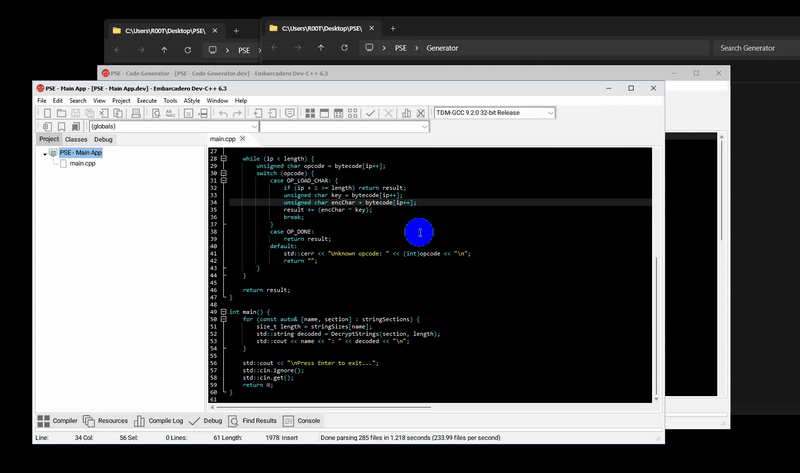

# 🐰 PSP - Polymorphic String Encryptor for C++
PSP is an string encryption utility for C++ programmers to avoid expose sensitive strings during static & dynamic analysis easily.

## Features & Details
- Uses Standard C++ ( in case DevC++ )
- Simple XOR Encryption within key support.
- Support Multiple String Encryption / Decryption.
- Dynamic Code Generation.

## 🪄 How to Use
Just below video , generate encrypted strings and put generated code in your decryption code , compile and enjoy !

## This project is part of my training course.
[more information on my Telegram Channel)]([https://t.me/VSEC_academy)
